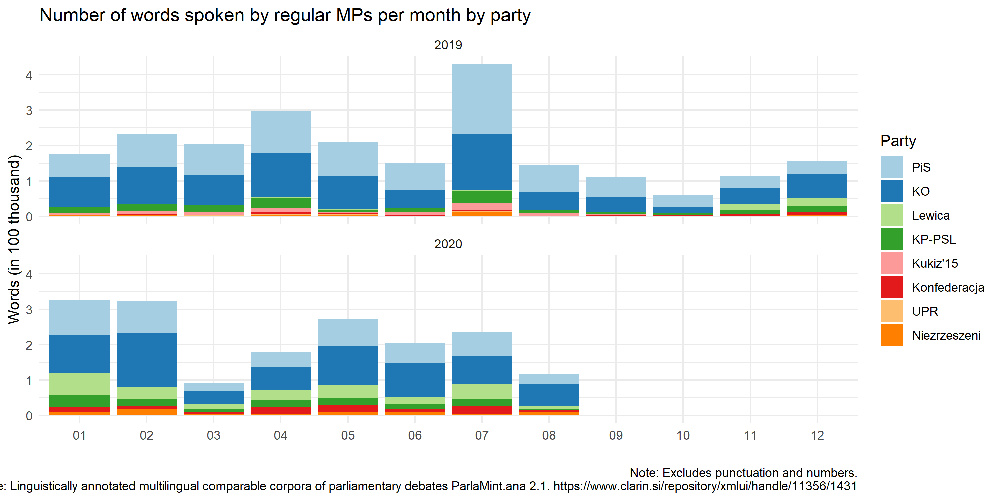
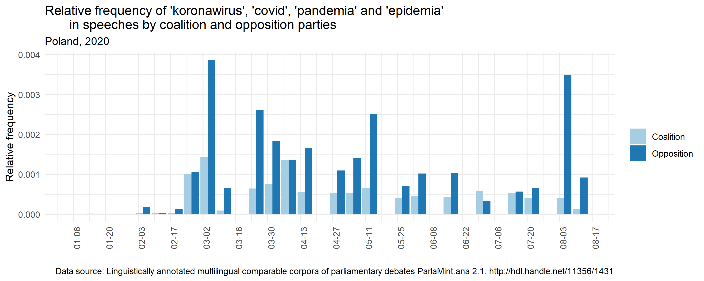

# Exploring the ParlaMint 2.0 dataset for Poland, 2019-2020

The code used for graphs and tables below is available [here](https://github.com/mkolczynska/parlamint/blob/main/scripts/exploration.R).

The post uses ideas from the [ParlaMint project at the Helsinki Digital Humanities Hackathon #DHH21](https://dhhackathon.wordpress.com/2021/05/28/parliamentary-debates-in-the-covid-times/) and from [Ruben Ros' work with the ParlaMint data](https://github.com/rubenros1795/ParlaMintCase).

## Basic statistics

First, some basic numbers. The dataset with parliamentary speeches from the parliament of Poland from 2019 and 2020 contains 7'816'267 tokens, 529'971 sentences in 72'192 speeches by 887 unique speakers. The data cover the period from 16 January 2019 to 18 August 2020, which includes the last months of the VIII term of the lower house (Sejm) and IX term of the upper house (Senat) which ended in October 2019, and the IX term of the Sejm and X term of the Senate starting in November 2019 through August 2020 when the data collection ended.

Of the almost 8 million tokens, around 1.3 million are punctuation. Frequencies of [parts of speech](https://universaldependencies.org/u/pos/index.html) are presented below. The dataset also includes multiple other [features](https://universaldependencies.org/u/feat/index.html) of the tokens, dependency relationships, as well as named entity status and type.

The data creators divided the corpus into two subcorpora. The COVID subcorpus starts in November 2019 and continues until the end of the dataset's time span, and the Reference subcorpus before November 2019, with the intention of facilitating comparisons in parliamentary speeches during the COVID-19 pandemic compared to earlier times.

## Speech statistics

The data enable various kinds of summary calculations of speeches and speakers. For example, one can find the longest speeches by regular MPs (thus excluding chairpersons and non-MP guests) in both houses and both terms (within 2019-2020). In the earlier term (IX in the Senate and VIII in the Sejm), both longest speeches were by MPs of the ruling party, Law and Justice (Prawo i Sprawiedliwość, PiS). In the current term (X in the Senate and IX in the Sejm), both longest speeches were by MPs of the opposition left-wing party called the Left (Lewica). The speech from 27 March 2020 referred to reactions to the COVID-19 pandemic. The other three speeches presented the work of parliamentary commissions or drafts of resolutions.

In terms of highest numbers of speeches, the leader was Grzegorz Braun from the opposition right-wing party Confederation Liberty and Independence (Konfederacja Wolność i Niepodległość) with 686 speeches.

The next graphs show the distribution of words, speeches and unique speakers by party by month for the two years covered by the data. In terms of words and speeches, the ruling party (PiS) spoke less than the main opposition party (KO) during most months. In terms of speakers, among regular MPs, PiS and KO were more or less equal in the earlier parliamentary term, which ended in October 2019. The exception is again July 2019, when 173 PiS MPs spoke (135 in the lower and 38 in the upper house) compared to 129 KO MPs(108 in the lower house and 21 in the upper house). Starting with November 2019, KO -- who won 134 seats in the Sejm and 43 in the Senat -- had more MPs make speeches in the parliament compared to PiS (235 seats in the Sejm, 48 in the Senat).

## Keywords

Keywords are words that are characteristic for the given corpus compared to the reference corpus. Below are top 10 keywords, according to the [keyness score](https://www.sketchengine.eu/documentation/simple-maths/), which are characteristic for the COVID subcorpus (starting November 2019) compared to the Reference subcorpus (throigh October 2019). Eight of them deal with the pandemic: koronawirus (coronavirus), pandemia (pandemic), antykryzysowy (anti-crisis), maseczka (mask), covid-19, kwarantanna (quarantine), epidemiczny (epidemic, adj.), and covid. Kukiz-15 is the name of a party, while "nasiennictwo" was mentioned as part of discussions about the Państwowa Inspekcja Ochrony Roślin i Nasiennictwa (Main Inspectorate of Plant Health and Seed Inspection) between December 2019 and June 2020.

## Collocation networks

Collocations are sets of words that commonly co-occur. Examining them can tell something about the context in which words are uttered. Below are two collocation networks for the keywords 'koronawirus'. The first one only shows the strongest collocates of 'koronawirus', while the second one -- also collocates of the collocates. 

## Collocations over time

Below are top collocates of the word 'koronawirus' in each month from February until August 2020. The word 'epidemic' was among the top collocates throughout this period, while 'pandemic' joined in March. In each month the word 'walka' (fight) has been frequently associated with 'coronavirus'. 'Kryzys' (crisis) became a top collocate in July and August. Other words in the table refer to infections (zarazić, zakazić, zakażenie), cases (przypadek), fight (walczyć, verb), COVID-19 and Sars-cov-2. Vaccine (szczepionka) shows up only once, in May.

## Timeline graphs

Timeline graphs show the relative frequencies of the terms 'koronawirus', 'covid', 'pandemia', and 'epidemia' by regular MPs by week. The highest frequencies were in the first week of March 2020, which coincided with the first cases of the coronavirus in Poland. The second peak was in the first week of August. The graph also shows that the term 'koronawirus' was much more often used in Poland than 'COVID', and the word 'epidemia' (epidemic) remained more popular than 'pandemia' (pandemic), althought the latter was used relatively frequently especially in the late spring and summer.

The second timeline shows the relative frequencies of all the four words ('koronawirus', 'covid', 'pandemia', 'epidemia') by MPs of the government (light blue bars) and of the opposition (dark blue bars) per week. It shows that overall, the opposition spoke much more, over twice as much, about the pandemic than the MPs of the ruling party.

